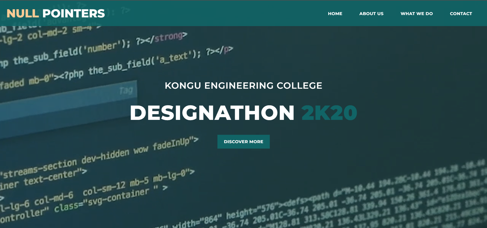
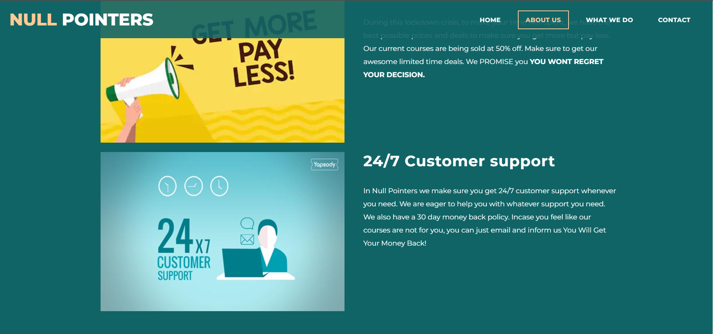
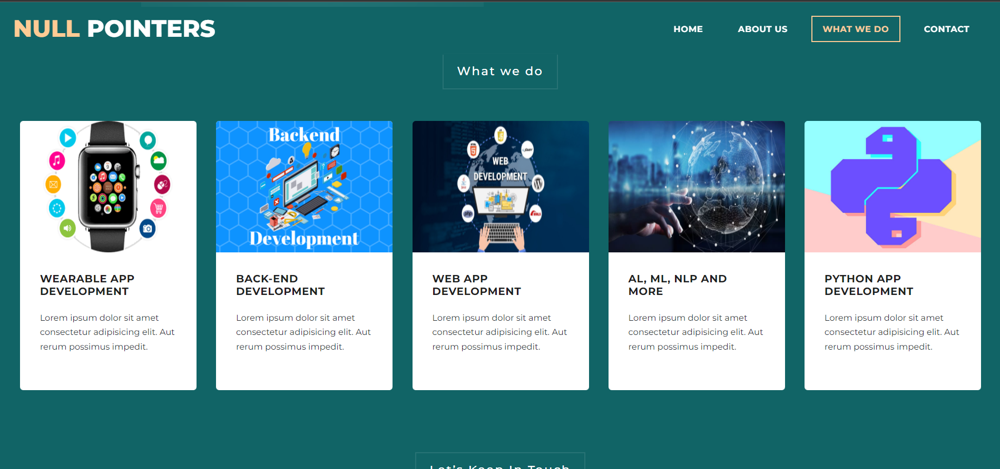
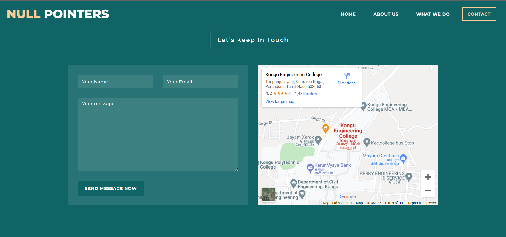
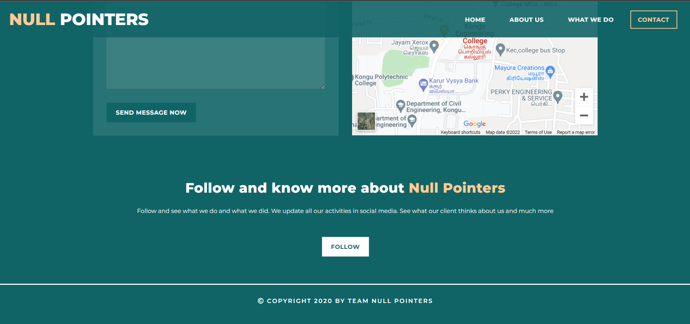

# Designation-2k20
  - This website is built for one of my college contest.
  - This is purely a design oriented round.
  - Built using HTML and CSS
  - This page was hosted using heruko
  - webpage link : https://null-pointers-designathon-2020.herokuapp.com/
  - also hosted in github pages - https://raveen2001.github.io/designation-2k20/

